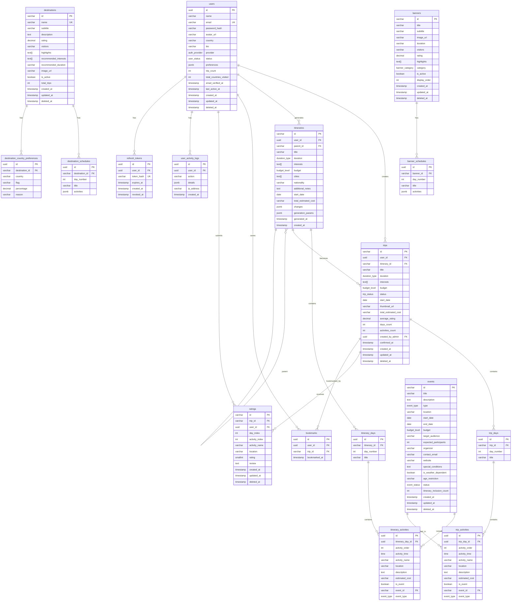

# Korea Travel AI Assistant - PostgreSQL Database Schema

> Version: 1.1.0
> Last Updated: 2024-12-23
> Database: PostgreSQL 15+
> Review Status: Reviewed and Updated

---

## Table of Contents

1. [Overview](#1-overview)
2. [ERD Diagram](#2-erd-diagram)
3. [ENUM Type Definitions](#3-enum-type-definitions)
4. [Table Definitions](#4-table-definitions)
5. [Index Definitions](#5-index-definitions)
6. [Relationships](#6-relationships)
7. [Triggers and Functions](#7-triggers-and-functions)
8. [Seed Data](#8-seed-data)
9. [Performance Considerations](#9-performance-considerations)
10. [Schema Review Notes](#10-schema-review-notes)

---

## 1. Overview

### 1.1 Design Principles

- **Normalization**: 3NF applied for data integrity, with strategic denormalization for performance
- **PostgreSQL Features**: JSONB for flexible data, Array types for lists, full-text search
- **Referential Integrity**: Foreign keys with appropriate ON DELETE actions
- **Soft Delete**: `deleted_at` column for recoverable deletions
- **Audit Trail**: `created_at`, `updated_at` columns on all tables
- **UUID Primary Keys**: For security and distributed system compatibility

### 1.2 Database Objects Summary

| Object Type | Count |
|-------------|-------|
| Tables | 14 |
| ENUM Types | 9 |
| Indexes | 40+ |
| Triggers | 8 |
| Functions | 6 |

---

## 2. ERD Diagram



---

## 3. ENUM Type Definitions

```sql
-- ============================================
-- ENUM TYPE DEFINITIONS
-- ============================================

-- User authentication provider
CREATE TYPE auth_provider AS ENUM ('google', 'email');

-- User account status
CREATE TYPE user_status AS ENUM ('active', 'inactive', 'banned');

-- Trip status
CREATE TYPE trip_status AS ENUM ('upcoming', 'ongoing', 'completed');

-- Event status
CREATE TYPE event_status AS ENUM ('draft', 'active', 'ended', 'cancelled');

-- Budget level
CREATE TYPE budget_level AS ENUM ('budget', 'mid-range', 'luxury');

-- Duration type
CREATE TYPE duration_type AS ENUM ('3 days', '5 days', '7 days', '10+ days');

-- Event type
CREATE TYPE event_type AS ENUM (
    'festival',
    'concert',
    'exhibition',
    'sports',
    'cultural',
    'food',
    'seasonal',
    'other'
);

-- Banner category
CREATE TYPE banner_category AS ENUM (
    'Urban',
    'Nature',
    'Cultural',
    'Food',
    'Historical',
    'Coastal'
);

-- Activity trend
CREATE TYPE trend_direction AS ENUM ('up', 'down', 'stable');

-- User role (Added: C-03 fix)
CREATE TYPE user_role AS ENUM ('user', 'admin');
```

---

## 4. Table Definitions

### 4.1 Users Table

```sql
-- ============================================
-- USERS TABLE
-- ============================================
-- Core user accounts table
-- Supports both Google OAuth and email authentication

CREATE TABLE users (
    id UUID PRIMARY KEY DEFAULT gen_random_uuid(),

    -- Basic Info
    name VARCHAR(100) NOT NULL,
    email VARCHAR(255) NOT NULL,
    password_hash VARCHAR(255), -- NULL for OAuth users
    avatar_url VARCHAR(500),
    country VARCHAR(100),
    bio VARCHAR(500),

    -- Authentication
    provider auth_provider NOT NULL DEFAULT 'email',
    google_id VARCHAR(100), -- Google OAuth ID

    -- Account Status
    status user_status NOT NULL DEFAULT 'active',
    role user_role NOT NULL DEFAULT 'user', -- Added: C-03 fix - User role for RBAC
    status_changed_at TIMESTAMP WITH TIME ZONE,
    status_changed_by UUID, -- Admin who changed status
    status_reason TEXT, -- Reason for status change (e.g., ban reason)

    -- Preferences (JSONB for flexibility)
    preferences JSONB DEFAULT '{
        "interests": [],
        "budgetPreference": null
    }'::jsonb,

    -- Statistics (denormalized for performance)
    trip_count INTEGER NOT NULL DEFAULT 0,
    total_countries_visited INTEGER NOT NULL DEFAULT 0,
    total_ratings INTEGER NOT NULL DEFAULT 0,

    -- Email verification (Security: tokens should be hashed)
    email_verified_at TIMESTAMP WITH TIME ZONE,
    email_verification_token_hash VARCHAR(255), -- Renamed: store hashed token for security
    email_verification_expires_at TIMESTAMP WITH TIME ZONE,

    -- Password reset (Security: tokens should be hashed)
    password_reset_token_hash VARCHAR(255), -- Renamed: store hashed token for security
    password_reset_expires_at TIMESTAMP WITH TIME ZONE,

    -- Activity tracking
    last_active_at TIMESTAMP WITH TIME ZONE,

    -- Timestamps
    created_at TIMESTAMP WITH TIME ZONE NOT NULL DEFAULT NOW(),
    updated_at TIMESTAMP WITH TIME ZONE NOT NULL DEFAULT NOW(),
    deleted_at TIMESTAMP WITH TIME ZONE, -- Soft delete

    -- Constraints
    CONSTRAINT users_email_unique UNIQUE (email),
    CONSTRAINT users_google_id_unique UNIQUE (google_id),
    CONSTRAINT users_name_length CHECK (LENGTH(name) >= 2 AND LENGTH(name) <= 100),
    CONSTRAINT users_bio_length CHECK (bio IS NULL OR LENGTH(bio) <= 200) -- Fixed: m-03 - API specifies 200 chars
);

-- Add comment
COMMENT ON TABLE users IS 'User accounts for both customers and administrators';
COMMENT ON COLUMN users.preferences IS 'JSONB containing user preferences: interests array and budgetPreference';
COMMENT ON COLUMN users.trip_count IS 'Denormalized count of confirmed trips for performance';
COMMENT ON COLUMN users.role IS 'User role for RBAC: user (default) or admin';
```

### 4.2 Refresh Tokens Table

```sql
-- ============================================
-- REFRESH TOKENS TABLE
-- ============================================
-- JWT refresh token storage for secure token management

CREATE TABLE refresh_tokens (
    id UUID PRIMARY KEY DEFAULT gen_random_uuid(),
    user_id UUID NOT NULL,
    token_hash VARCHAR(255) NOT NULL, -- Hashed token for security
    device_info JSONB, -- Optional device/browser info
    ip_address INET,
    expires_at TIMESTAMP WITH TIME ZONE NOT NULL,
    created_at TIMESTAMP WITH TIME ZONE NOT NULL DEFAULT NOW(),
    revoked_at TIMESTAMP WITH TIME ZONE, -- NULL if token is valid

    -- Constraints
    CONSTRAINT refresh_tokens_user_fk FOREIGN KEY (user_id)
        REFERENCES users(id) ON DELETE CASCADE,
    CONSTRAINT refresh_tokens_hash_unique UNIQUE (token_hash)
);

COMMENT ON TABLE refresh_tokens IS 'Stores refresh tokens for JWT authentication';
```

### 4.3 Destinations Table

```sql
-- ============================================
-- DESTINATIONS TABLE
-- ============================================
-- Korean travel destinations (15 cities/regions)

CREATE TABLE destinations (
    id VARCHAR(50) PRIMARY KEY, -- e.g., 'dest_seoul'

    -- Basic Info
    name VARCHAR(100) NOT NULL,
    subtitle VARCHAR(200),
    description TEXT,

    -- Metrics
    rating DECIMAL(2,1) DEFAULT 0.0, -- Average rating (0.0-5.0)
    visitors VARCHAR(50), -- e.g., "12M+"

    -- Arrays for flexible data
    highlights TEXT[] DEFAULT ARRAY[]::TEXT[],
    recommended_interests TEXT[] DEFAULT ARRAY[]::TEXT[],
    recommended_duration VARCHAR(50), -- e.g., "3-5 days"

    -- Media
    image_url VARCHAR(500),

    -- Statistics (denormalized)
    total_trips INTEGER NOT NULL DEFAULT 0,
    total_ratings INTEGER NOT NULL DEFAULT 0,

    -- Status
    is_active BOOLEAN NOT NULL DEFAULT true,

    -- Timestamps
    created_at TIMESTAMP WITH TIME ZONE NOT NULL DEFAULT NOW(),
    updated_at TIMESTAMP WITH TIME ZONE NOT NULL DEFAULT NOW(),
    deleted_at TIMESTAMP WITH TIME ZONE,

    -- Constraints
    CONSTRAINT destinations_name_unique UNIQUE (name),
    CONSTRAINT destinations_rating_range CHECK (rating >= 0 AND rating <= 5)
);

COMMENT ON TABLE destinations IS 'Korean travel destinations with highlights and recommendations';
COMMENT ON COLUMN destinations.highlights IS 'Array of notable attractions or features';
COMMENT ON COLUMN destinations.recommended_interests IS 'Array of interest categories this destination is good for';
```

### 4.4 Destination Country Preferences Table

```sql
-- ============================================
-- DESTINATION COUNTRY PREFERENCES TABLE
-- ============================================
-- Which countries prefer which destinations

CREATE TABLE destination_country_preferences (
    id UUID PRIMARY KEY DEFAULT gen_random_uuid(),
    destination_id VARCHAR(50) NOT NULL,
    country VARCHAR(100) NOT NULL,
    flag VARCHAR(10), -- Emoji flag
    percentage DECIMAL(5,2) NOT NULL, -- Percentage of visitors from this country
    reason VARCHAR(255), -- Why this country prefers this destination

    -- Constraints
    CONSTRAINT dest_country_prefs_dest_fk FOREIGN KEY (destination_id)
        REFERENCES destinations(id) ON DELETE CASCADE,
    CONSTRAINT dest_country_prefs_unique UNIQUE (destination_id, country),
    CONSTRAINT dest_country_prefs_percentage CHECK (percentage >= 0 AND percentage <= 100)
);

COMMENT ON TABLE destination_country_preferences IS 'Statistics on which nationalities prefer which destinations';
```

### 4.5 Destination Schedules Table

```sql
-- ============================================
-- DESTINATION SCHEDULES TABLE
-- ============================================
-- Recommended daily schedules for destinations

CREATE TABLE destination_schedules (
    id UUID PRIMARY KEY DEFAULT gen_random_uuid(),
    destination_id VARCHAR(50) NOT NULL,
    day_number INTEGER NOT NULL,
    title VARCHAR(200) NOT NULL, -- e.g., "Historical Seoul"

    -- Activities as JSONB array for flexibility
    -- Structure: [{"time": "09:00", "name": "...", "description": "..."}]
    activities JSONB NOT NULL DEFAULT '[]'::jsonb,

    -- Constraints
    CONSTRAINT dest_schedules_dest_fk FOREIGN KEY (destination_id)
        REFERENCES destinations(id) ON DELETE CASCADE,
    CONSTRAINT dest_schedules_unique UNIQUE (destination_id, day_number),
    CONSTRAINT dest_schedules_day_positive CHECK (day_number > 0)
);

COMMENT ON TABLE destination_schedules IS 'Recommended daily itinerary for each destination';
COMMENT ON COLUMN destination_schedules.activities IS 'JSONB array of activities with time, name, description';
```

### 4.6 Banners Table

```sql
-- ============================================
-- BANNERS TABLE
-- ============================================
-- Suggested travel course banners

CREATE TABLE banners (
    id VARCHAR(50) PRIMARY KEY, -- e.g., 'banner_001'

    -- Basic Info
    title VARCHAR(200) NOT NULL,
    subtitle VARCHAR(300),
    image_url VARCHAR(500),
    duration VARCHAR(50), -- e.g., "3 days"

    -- Metrics
    visitors VARCHAR(50), -- e.g., "5K+"
    rating DECIMAL(2,1) DEFAULT 0.0,

    -- Classification
    highlights TEXT[] DEFAULT ARRAY[]::TEXT[],
    category banner_category,

    -- Display
    is_active BOOLEAN NOT NULL DEFAULT true,
    display_order INTEGER NOT NULL DEFAULT 0,

    -- Timestamps
    created_at TIMESTAMP WITH TIME ZONE NOT NULL DEFAULT NOW(),
    updated_at TIMESTAMP WITH TIME ZONE NOT NULL DEFAULT NOW(),
    deleted_at TIMESTAMP WITH TIME ZONE,

    -- Constraints
    CONSTRAINT banners_rating_range CHECK (rating >= 0 AND rating <= 5)
);

COMMENT ON TABLE banners IS 'Featured travel course banners displayed on homepage';
```

### 4.7 Banner Schedules Table

```sql
-- ============================================
-- BANNER SCHEDULES TABLE
-- ============================================
-- Detailed schedules for banner courses

CREATE TABLE banner_schedules (
    id UUID PRIMARY KEY DEFAULT gen_random_uuid(),
    banner_id VARCHAR(50) NOT NULL,
    day_number INTEGER NOT NULL,
    title VARCHAR(200) NOT NULL,

    -- Activities as JSONB array
    activities JSONB NOT NULL DEFAULT '[]'::jsonb,

    -- Constraints
    CONSTRAINT banner_schedules_banner_fk FOREIGN KEY (banner_id)
        REFERENCES banners(id) ON DELETE CASCADE,
    CONSTRAINT banner_schedules_unique UNIQUE (banner_id, day_number),
    CONSTRAINT banner_schedules_day_positive CHECK (day_number > 0)
);

COMMENT ON TABLE banner_schedules IS 'Daily schedule details for banner travel courses';
```

### 4.8 Events Table

```sql
-- ============================================
-- EVENTS TABLE
-- ============================================
-- Korean events, festivals, exhibitions

CREATE TABLE events (
    id VARCHAR(50) PRIMARY KEY, -- e.g., 'evt_winter2024'

    -- Basic Info
    title VARCHAR(200) NOT NULL,
    description TEXT,
    type event_type NOT NULL,
    location VARCHAR(300) NOT NULL,

    -- Date Range
    start_date DATE NOT NULL,
    end_date DATE NOT NULL,

    -- Details
    budget budget_level,
    target_audience VARCHAR(200),
    expected_participants INTEGER,
    organizer VARCHAR(200),
    contact_email VARCHAR(255),
    website VARCHAR(500),
    special_conditions TEXT,
    is_weather_dependent BOOLEAN NOT NULL DEFAULT false,
    age_restriction VARCHAR(100),

    -- Status
    status event_status NOT NULL DEFAULT 'draft',

    -- Statistics (denormalized)
    itinerary_inclusion_count INTEGER NOT NULL DEFAULT 0,

    -- Timestamps
    created_at TIMESTAMP WITH TIME ZONE NOT NULL DEFAULT NOW(),
    updated_at TIMESTAMP WITH TIME ZONE NOT NULL DEFAULT NOW(),
    deleted_at TIMESTAMP WITH TIME ZONE,

    -- Constraints
    CONSTRAINT events_date_range CHECK (end_date >= start_date),
    CONSTRAINT events_title_length CHECK (LENGTH(title) >= 5 AND LENGTH(title) <= 200),
    CONSTRAINT events_description_length CHECK (description IS NULL OR LENGTH(description) <= 2000)
);

COMMENT ON TABLE events IS 'Korean events, festivals, and exhibitions that can be included in itineraries';
```

### 4.9 Itineraries Table

```sql
-- ============================================
-- ITINERARIES TABLE
-- ============================================
-- AI-generated travel itineraries (before confirmation)

CREATE TABLE itineraries (
    id VARCHAR(50) PRIMARY KEY, -- e.g., 'itin_abc123'
    user_id UUID NOT NULL,
    parent_id VARCHAR(50), -- For regenerated itineraries

    -- Basic Info
    title VARCHAR(300) NOT NULL,
    duration duration_type NOT NULL,
    interests TEXT[] NOT NULL DEFAULT ARRAY[]::TEXT[],
    budget budget_level NOT NULL,
    cities TEXT[] NOT NULL DEFAULT ARRAY[]::TEXT[],
    nationality VARCHAR(100),
    additional_notes TEXT,
    start_date DATE,

    -- Cost
    total_estimated_cost VARCHAR(100), -- e.g., "850,000 - 1,200,000"

    -- Regeneration tracking
    changes JSONB, -- Changes made from parent itinerary
    generation_params JSONB, -- Parameters used for generation

    -- Timestamps
    generated_at TIMESTAMP WITH TIME ZONE NOT NULL DEFAULT NOW(),
    created_at TIMESTAMP WITH TIME ZONE NOT NULL DEFAULT NOW(),
    updated_at TIMESTAMP WITH TIME ZONE NOT NULL DEFAULT NOW(), -- Added: C-04 fix

    -- Constraints
    CONSTRAINT itineraries_user_fk FOREIGN KEY (user_id)
        REFERENCES users(id) ON DELETE CASCADE,
    CONSTRAINT itineraries_parent_fk FOREIGN KEY (parent_id)
        REFERENCES itineraries(id) ON DELETE SET NULL,
    CONSTRAINT itineraries_cities_not_empty CHECK (array_length(cities, 1) >= 1),
    CONSTRAINT itineraries_interests_not_empty CHECK (array_length(interests, 1) >= 1)
);

COMMENT ON TABLE itineraries IS 'AI-generated itineraries before user confirmation';
COMMENT ON COLUMN itineraries.parent_id IS 'Reference to original itinerary if this was regenerated';
COMMENT ON COLUMN itineraries.changes IS 'JSONB array describing changes made during regeneration';
```

### 4.10 Itinerary Days Table

```sql
-- ============================================
-- ITINERARY DAYS TABLE
-- ============================================
-- Days within a generated itinerary

CREATE TABLE itinerary_days (
    id UUID PRIMARY KEY DEFAULT gen_random_uuid(),
    itinerary_id VARCHAR(50) NOT NULL,
    day_number INTEGER NOT NULL,
    title VARCHAR(200) NOT NULL, -- e.g., "Arrival & Seoul Exploration"

    -- Constraints
    CONSTRAINT itin_days_itin_fk FOREIGN KEY (itinerary_id)
        REFERENCES itineraries(id) ON DELETE CASCADE,
    CONSTRAINT itin_days_unique UNIQUE (itinerary_id, day_number),
    CONSTRAINT itin_days_number_positive CHECK (day_number > 0)
);

COMMENT ON TABLE itinerary_days IS 'Individual days within a generated itinerary';
```

### 4.11 Itinerary Activities Table

```sql
-- ============================================
-- ITINERARY ACTIVITIES TABLE
-- ============================================
-- Activities within each itinerary day

CREATE TABLE itinerary_activities (
    id UUID PRIMARY KEY DEFAULT gen_random_uuid(),
    itinerary_day_id UUID NOT NULL,
    activity_order INTEGER NOT NULL,

    -- Activity Details
    activity_time TIME, -- e.g., "09:00"
    activity_name VARCHAR(300) NOT NULL,
    location VARCHAR(300),
    description TEXT,
    estimated_cost VARCHAR(50), -- e.g., "9,500"

    -- Event Reference
    is_event BOOLEAN NOT NULL DEFAULT false,
    event_id VARCHAR(50), -- Reference to events table
    event_type event_type, -- Denormalized for performance

    -- Constraints
    CONSTRAINT itin_activities_day_fk FOREIGN KEY (itinerary_day_id)
        REFERENCES itinerary_days(id) ON DELETE CASCADE,
    CONSTRAINT itin_activities_event_fk FOREIGN KEY (event_id)
        REFERENCES events(id) ON DELETE SET NULL,
    CONSTRAINT itin_activities_order_unique UNIQUE (itinerary_day_id, activity_order),
    CONSTRAINT itin_activities_event_consistency
        CHECK ((is_event = true AND event_id IS NOT NULL) OR (is_event = false))
);

COMMENT ON TABLE itinerary_activities IS 'Individual activities within each itinerary day';
```

### 4.12 Trips Table

```sql
-- ============================================
-- TRIPS TABLE
-- ============================================
-- Confirmed/saved trips from itineraries

CREATE TABLE trips (
    id VARCHAR(50) PRIMARY KEY, -- e.g., 'trip_abc123'
    user_id UUID NOT NULL,
    itinerary_id VARCHAR(50), -- Source itinerary

    -- Basic Info (denormalized from itinerary)
    title VARCHAR(300) NOT NULL,
    duration duration_type NOT NULL,
    interests TEXT[] NOT NULL DEFAULT ARRAY[]::TEXT[],
    budget budget_level NOT NULL,
    cities TEXT[] NOT NULL DEFAULT ARRAY[]::TEXT[],

    -- Status
    status trip_status NOT NULL DEFAULT 'upcoming',
    start_date DATE,

    -- Media
    thumbnail_url VARCHAR(500),

    -- Cost
    total_estimated_cost VARCHAR(100),

    -- Statistics (denormalized)
    average_rating DECIMAL(2,1),
    days_count INTEGER NOT NULL DEFAULT 0,
    activities_count INTEGER NOT NULL DEFAULT 0,

    -- Admin creation
    created_by_admin UUID, -- If created by admin for user

    -- Timestamps
    confirmed_at TIMESTAMP WITH TIME ZONE NOT NULL DEFAULT NOW(),
    created_at TIMESTAMP WITH TIME ZONE NOT NULL DEFAULT NOW(),
    updated_at TIMESTAMP WITH TIME ZONE NOT NULL DEFAULT NOW(),
    deleted_at TIMESTAMP WITH TIME ZONE,

    -- Constraints
    CONSTRAINT trips_user_fk FOREIGN KEY (user_id)
        REFERENCES users(id) ON DELETE CASCADE,
    CONSTRAINT trips_itinerary_fk FOREIGN KEY (itinerary_id)
        REFERENCES itineraries(id) ON DELETE SET NULL,
    CONSTRAINT trips_admin_fk FOREIGN KEY (created_by_admin)
        REFERENCES users(id) ON DELETE SET NULL,
    CONSTRAINT trips_rating_range CHECK (average_rating IS NULL OR (average_rating >= 0 AND average_rating <= 5))
);

COMMENT ON TABLE trips IS 'Confirmed user trips, created from itineraries';
COMMENT ON COLUMN trips.itinerary_id IS 'Reference to source itinerary (may be NULL if admin-created)';
```

### 4.13 Trip Days Table

```sql
-- ============================================
-- TRIP DAYS TABLE
-- ============================================
-- Days within a confirmed trip

CREATE TABLE trip_days (
    id UUID PRIMARY KEY DEFAULT gen_random_uuid(),
    trip_id VARCHAR(50) NOT NULL,
    day_number INTEGER NOT NULL,
    title VARCHAR(200) NOT NULL,

    -- Constraints
    CONSTRAINT trip_days_trip_fk FOREIGN KEY (trip_id)
        REFERENCES trips(id) ON DELETE CASCADE,
    CONSTRAINT trip_days_unique UNIQUE (trip_id, day_number),
    CONSTRAINT trip_days_number_positive CHECK (day_number > 0)
);

COMMENT ON TABLE trip_days IS 'Individual days within a confirmed trip';
```

### 4.14 Trip Activities Table

```sql
-- ============================================
-- TRIP ACTIVITIES TABLE
-- ============================================
-- Activities within each trip day

CREATE TABLE trip_activities (
    id UUID PRIMARY KEY DEFAULT gen_random_uuid(),
    trip_day_id UUID NOT NULL,
    activity_order INTEGER NOT NULL,

    -- Activity Details
    activity_time TIME,
    activity_name VARCHAR(300) NOT NULL,
    location VARCHAR(300),
    description TEXT,
    estimated_cost VARCHAR(50),

    -- Event Reference
    is_event BOOLEAN NOT NULL DEFAULT false,
    event_id VARCHAR(50),
    event_type event_type,

    -- Constraints
    CONSTRAINT trip_activities_day_fk FOREIGN KEY (trip_day_id)
        REFERENCES trip_days(id) ON DELETE CASCADE,
    CONSTRAINT trip_activities_event_fk FOREIGN KEY (event_id)
        REFERENCES events(id) ON DELETE SET NULL,
    CONSTRAINT trip_activities_order_unique UNIQUE (trip_day_id, activity_order)
);

COMMENT ON TABLE trip_activities IS 'Individual activities within each trip day';
```

### 4.15 Ratings Table

```sql
-- ============================================
-- RATINGS TABLE
-- ============================================
-- User ratings for trip activities
-- NOTE (C-02): This table uses denormalized activity_name/location for backward compatibility.
-- For strict referential integrity, consider using trip_activity_id FK instead.

CREATE TABLE ratings (
    id VARCHAR(50) PRIMARY KEY, -- e.g., 'rating_001'
    trip_id VARCHAR(50) NOT NULL,
    user_id UUID NOT NULL,
    trip_activity_id UUID, -- Added: C-02 fix - Optional FK for strict integrity

    -- Activity Reference (kept for backward compatibility, but prefer trip_activity_id)
    day_index INTEGER NOT NULL, -- 0-based day index
    activity_index INTEGER NOT NULL, -- 0-based activity index
    activity_name VARCHAR(300) NOT NULL, -- Denormalized for display (D-01 note: may become stale)
    location VARCHAR(300), -- Denormalized for display (D-01 note: may become stale)

    -- Rating
    rating SMALLINT NOT NULL,
    review TEXT,

    -- Moderation
    is_hidden BOOLEAN NOT NULL DEFAULT false,
    hidden_reason TEXT,
    hidden_by UUID, -- Admin who hid the rating

    -- Timestamps
    created_at TIMESTAMP WITH TIME ZONE NOT NULL DEFAULT NOW(),
    updated_at TIMESTAMP WITH TIME ZONE NOT NULL DEFAULT NOW(),
    deleted_at TIMESTAMP WITH TIME ZONE,

    -- Constraints
    CONSTRAINT ratings_trip_fk FOREIGN KEY (trip_id)
        REFERENCES trips(id) ON DELETE CASCADE,
    CONSTRAINT ratings_user_fk FOREIGN KEY (user_id)
        REFERENCES users(id) ON DELETE CASCADE,
    CONSTRAINT ratings_activity_fk FOREIGN KEY (trip_activity_id) -- Added: C-02 fix
        REFERENCES trip_activities(id) ON DELETE SET NULL,
    CONSTRAINT ratings_hidden_by_fk FOREIGN KEY (hidden_by)
        REFERENCES users(id) ON DELETE SET NULL,
    CONSTRAINT ratings_value_range CHECK (rating >= 1 AND rating <= 5),
    CONSTRAINT ratings_review_length CHECK (review IS NULL OR LENGTH(review) <= 500),
    CONSTRAINT ratings_unique_per_activity UNIQUE (trip_id, user_id, day_index, activity_index)
);

COMMENT ON TABLE ratings IS 'User ratings and reviews for trip activities';
COMMENT ON COLUMN ratings.day_index IS '0-based index referencing the day within the trip';
COMMENT ON COLUMN ratings.activity_index IS '0-based index referencing the activity within the day';
COMMENT ON COLUMN ratings.trip_activity_id IS 'Optional FK to trip_activities for strict referential integrity (C-02 fix)';
```

### 4.16 Bookmarks Table

```sql
-- ============================================
-- BOOKMARKS TABLE
-- ============================================
-- User bookmarked trips

CREATE TABLE bookmarks (
    id UUID PRIMARY KEY DEFAULT gen_random_uuid(),
    user_id UUID NOT NULL,
    trip_id VARCHAR(50) NOT NULL,
    bookmarked_at TIMESTAMP WITH TIME ZONE NOT NULL DEFAULT NOW(),

    -- Constraints
    CONSTRAINT bookmarks_user_fk FOREIGN KEY (user_id)
        REFERENCES users(id) ON DELETE CASCADE,
    CONSTRAINT bookmarks_trip_fk FOREIGN KEY (trip_id)
        REFERENCES trips(id) ON DELETE CASCADE,
    CONSTRAINT bookmarks_unique UNIQUE (user_id, trip_id)
);

COMMENT ON TABLE bookmarks IS 'User bookmarked trips for later reference';
```

### 4.17 User Activity Logs Table

```sql
-- ============================================
-- USER ACTIVITY LOGS TABLE
-- ============================================
-- Audit trail for user actions

CREATE TABLE user_activity_logs (
    id UUID PRIMARY KEY DEFAULT gen_random_uuid(),
    user_id UUID NOT NULL,
    action VARCHAR(100) NOT NULL, -- e.g., 'trip_created', 'login', 'profile_updated'
    details JSONB, -- Additional context
    ip_address INET,
    user_agent TEXT,
    created_at TIMESTAMP WITH TIME ZONE NOT NULL DEFAULT NOW(),

    -- Constraints
    CONSTRAINT activity_logs_user_fk FOREIGN KEY (user_id)
        REFERENCES users(id) ON DELETE CASCADE
);

-- Partition by month for better performance on large datasets
-- (Uncomment if needed for production)
-- CREATE TABLE user_activity_logs (
--     ...
-- ) PARTITION BY RANGE (created_at);

COMMENT ON TABLE user_activity_logs IS 'Audit trail of user actions for admin monitoring';
```

### 4.18 Popular Activities Cache Table

```sql
-- ============================================
-- POPULAR ACTIVITIES CACHE TABLE
-- ============================================
-- Materialized/cached popular activities data

CREATE TABLE popular_activities_cache (
    id UUID PRIMARY KEY DEFAULT gen_random_uuid(),
    activity_name VARCHAR(300) NOT NULL,
    location VARCHAR(300) NOT NULL,
    category VARCHAR(100),
    total_bookings INTEGER NOT NULL DEFAULT 0,
    average_rating DECIMAL(2,1),
    rating_count INTEGER NOT NULL DEFAULT 0,
    trend trend_direction NOT NULL DEFAULT 'stable',
    trend_percentage DECIMAL(5,2) NOT NULL DEFAULT 0,
    period VARCHAR(20) NOT NULL, -- '7d', '30d', '90d', '1y'
    calculated_at TIMESTAMP WITH TIME ZONE NOT NULL DEFAULT NOW(),

    -- Constraints
    CONSTRAINT popular_activities_unique UNIQUE (activity_name, location, period)
);

COMMENT ON TABLE popular_activities_cache IS 'Cached popular activities statistics for admin dashboard';
```

---

## 5. Index Definitions

```sql
-- ============================================
-- INDEX DEFINITIONS
-- ============================================

-- ==================
-- Users Indexes
-- ==================
CREATE INDEX idx_users_email ON users(email) WHERE deleted_at IS NULL;
CREATE INDEX idx_users_status ON users(status) WHERE deleted_at IS NULL;
CREATE INDEX idx_users_status_created ON users(status, created_at DESC) WHERE deleted_at IS NULL;
CREATE INDEX idx_users_country ON users(country) WHERE deleted_at IS NULL;
CREATE INDEX idx_users_provider ON users(provider) WHERE deleted_at IS NULL;
CREATE INDEX idx_users_google_id ON users(google_id) WHERE google_id IS NOT NULL;
CREATE INDEX idx_users_last_active ON users(last_active_at DESC) WHERE deleted_at IS NULL;
CREATE INDEX idx_users_created_at ON users(created_at DESC);

-- Full-text search on name and email
CREATE INDEX idx_users_search ON users
    USING gin(to_tsvector('english', name || ' ' || email));

-- ==================
-- Refresh Tokens Indexes
-- ==================
CREATE INDEX idx_refresh_tokens_user ON refresh_tokens(user_id);
CREATE INDEX idx_refresh_tokens_expires ON refresh_tokens(expires_at)
    WHERE revoked_at IS NULL;

-- ==================
-- Destinations Indexes
-- ==================
CREATE INDEX idx_destinations_active ON destinations(is_active) WHERE deleted_at IS NULL;
CREATE INDEX idx_destinations_rating ON destinations(rating DESC) WHERE is_active = true;
CREATE INDEX idx_destinations_interests ON destinations USING gin(recommended_interests);

-- ==================
-- Banners Indexes
-- ==================
CREATE INDEX idx_banners_active ON banners(is_active, display_order) WHERE deleted_at IS NULL;
CREATE INDEX idx_banners_category ON banners(category) WHERE is_active = true;

-- ==================
-- Events Indexes
-- ==================
CREATE INDEX idx_events_status ON events(status) WHERE deleted_at IS NULL;
CREATE INDEX idx_events_dates ON events(start_date, end_date) WHERE status = 'active';
CREATE INDEX idx_events_status_dates ON events(status, start_date, end_date) WHERE deleted_at IS NULL;
CREATE INDEX idx_events_type ON events(type) WHERE deleted_at IS NULL;
CREATE INDEX idx_events_location ON events(location) WHERE deleted_at IS NULL;

-- Full-text search on events
CREATE INDEX idx_events_search ON events
    USING gin(to_tsvector('english', title || ' ' || COALESCE(description, '') || ' ' || location));

-- ==================
-- Itineraries Indexes
-- ==================
CREATE INDEX idx_itineraries_user ON itineraries(user_id);
CREATE INDEX idx_itineraries_generated ON itineraries(generated_at DESC);
CREATE INDEX idx_itineraries_cities ON itineraries USING gin(cities);
CREATE INDEX idx_itineraries_interests ON itineraries USING gin(interests);
-- Added: P-08 fix - Index for parent_id for regeneration history lookup
CREATE INDEX idx_itineraries_parent ON itineraries(parent_id) WHERE parent_id IS NOT NULL;

-- ==================
-- Itinerary Days Indexes
-- ==================
CREATE INDEX idx_itin_days_itinerary ON itinerary_days(itinerary_id);

-- ==================
-- Itinerary Activities Indexes
-- ==================
CREATE INDEX idx_itin_activities_day ON itinerary_activities(itinerary_day_id);
CREATE INDEX idx_itin_activities_event ON itinerary_activities(event_id) WHERE event_id IS NOT NULL;

-- ==================
-- Trips Indexes
-- ==================
CREATE INDEX idx_trips_user ON trips(user_id) WHERE deleted_at IS NULL;
CREATE INDEX idx_trips_user_status ON trips(user_id, status) WHERE deleted_at IS NULL;
CREATE INDEX idx_trips_status ON trips(status) WHERE deleted_at IS NULL;
CREATE INDEX idx_trips_confirmed ON trips(confirmed_at DESC) WHERE deleted_at IS NULL;
CREATE INDEX idx_trips_start_date ON trips(start_date) WHERE deleted_at IS NULL;
CREATE INDEX idx_trips_cities ON trips USING gin(cities);
CREATE INDEX idx_trips_interests ON trips USING gin(interests);

-- Full-text search on trips
CREATE INDEX idx_trips_search ON trips
    USING gin(to_tsvector('english', title));

-- ==================
-- Trip Days Indexes
-- ==================
CREATE INDEX idx_trip_days_trip ON trip_days(trip_id);

-- ==================
-- Trip Activities Indexes
-- ==================
CREATE INDEX idx_trip_activities_day ON trip_activities(trip_day_id);
CREATE INDEX idx_trip_activities_event ON trip_activities(event_id) WHERE event_id IS NOT NULL;

-- ==================
-- Ratings Indexes
-- ==================
CREATE INDEX idx_ratings_trip ON ratings(trip_id) WHERE deleted_at IS NULL;
CREATE INDEX idx_ratings_user ON ratings(user_id) WHERE deleted_at IS NULL;
CREATE INDEX idx_ratings_created ON ratings(created_at DESC) WHERE deleted_at IS NULL;
CREATE INDEX idx_ratings_value ON ratings(rating) WHERE deleted_at IS NULL;
CREATE INDEX idx_ratings_location ON ratings(location) WHERE deleted_at IS NULL;
CREATE INDEX idx_ratings_has_review ON ratings(id) WHERE review IS NOT NULL AND deleted_at IS NULL;
-- Added: P-06 fix - Composite index for activity lookup
CREATE INDEX idx_ratings_trip_activity ON ratings(trip_id, day_index, activity_index) WHERE deleted_at IS NULL;
-- Added: C-02 fix - Index for trip_activity_id FK
CREATE INDEX idx_ratings_activity_fk ON ratings(trip_activity_id) WHERE trip_activity_id IS NOT NULL;

-- ==================
-- Bookmarks Indexes
-- ==================
CREATE INDEX idx_bookmarks_user ON bookmarks(user_id);
CREATE INDEX idx_bookmarks_trip ON bookmarks(trip_id);
CREATE INDEX idx_bookmarks_user_date ON bookmarks(user_id, bookmarked_at DESC);

-- ==================
-- User Activity Logs Indexes
-- ==================
CREATE INDEX idx_activity_logs_user ON user_activity_logs(user_id);
CREATE INDEX idx_activity_logs_action ON user_activity_logs(action);
CREATE INDEX idx_activity_logs_created ON user_activity_logs(created_at DESC);
CREATE INDEX idx_activity_logs_user_action ON user_activity_logs(user_id, action, created_at DESC);

-- ==================
-- Popular Activities Cache Indexes
-- ==================
CREATE INDEX idx_popular_activities_period ON popular_activities_cache(period, calculated_at DESC);
CREATE INDEX idx_popular_activities_ranking ON popular_activities_cache(period, total_bookings DESC);
```

---

## 6. Relationships

### 6.1 Relationship Summary

| Parent Table | Child Table | Relationship | ON DELETE |
|--------------|-------------|--------------|-----------|
| users | refresh_tokens | 1:N | CASCADE |
| users | itineraries | 1:N | CASCADE |
| users | trips | 1:N | CASCADE |
| users | ratings | 1:N | CASCADE |
| users | bookmarks | 1:N | CASCADE |
| users | user_activity_logs | 1:N | CASCADE |
| destinations | destination_country_preferences | 1:N | CASCADE |
| destinations | destination_schedules | 1:N | CASCADE |
| banners | banner_schedules | 1:N | CASCADE |
| itineraries | itinerary_days | 1:N | CASCADE |
| itinerary_days | itinerary_activities | 1:N | CASCADE |
| itineraries | itineraries (self) | 1:N (parent) | SET NULL |
| itineraries | trips | 1:N | SET NULL |
| trips | trip_days | 1:N | CASCADE |
| trip_days | trip_activities | 1:N | CASCADE |
| trips | ratings | 1:N | CASCADE |
| trips | bookmarks | 1:N | CASCADE |
| events | itinerary_activities | 1:N | SET NULL |
| events | trip_activities | 1:N | SET NULL |

### 6.2 Relationship Diagram (Simplified)

```
users
  |
  +---> refresh_tokens (auth)
  |
  +---> itineraries --------+
  |       |                 |
  |       +---> itinerary_days
  |               |
  |               +---> itinerary_activities <--- events
  |
  +---> trips -----+
  |       |        |
  |       |        +---> trip_days
  |       |              |
  |       |              +---> trip_activities <--- events
  |       |
  |       +---> ratings
  |
  +---> bookmarks ---> trips
  |
  +---> user_activity_logs

destinations
  |
  +---> destination_country_preferences
  |
  +---> destination_schedules

banners
  |
  +---> banner_schedules
```

---

## 7. Triggers and Functions

### 7.1 Updated At Trigger Function

```sql
-- ============================================
-- UPDATED_AT TRIGGER FUNCTION
-- ============================================
-- Automatically updates the updated_at column

CREATE OR REPLACE FUNCTION update_updated_at_column()
RETURNS TRIGGER AS $$
BEGIN
    NEW.updated_at = NOW();
    RETURN NEW;
END;
$$ LANGUAGE plpgsql;

-- Apply to all tables with updated_at column
CREATE TRIGGER update_users_updated_at
    BEFORE UPDATE ON users
    FOR EACH ROW
    EXECUTE FUNCTION update_updated_at_column();

CREATE TRIGGER update_destinations_updated_at
    BEFORE UPDATE ON destinations
    FOR EACH ROW
    EXECUTE FUNCTION update_updated_at_column();

CREATE TRIGGER update_banners_updated_at
    BEFORE UPDATE ON banners
    FOR EACH ROW
    EXECUTE FUNCTION update_updated_at_column();

CREATE TRIGGER update_events_updated_at
    BEFORE UPDATE ON events
    FOR EACH ROW
    EXECUTE FUNCTION update_updated_at_column();

CREATE TRIGGER update_trips_updated_at
    BEFORE UPDATE ON trips
    FOR EACH ROW
    EXECUTE FUNCTION update_updated_at_column();

CREATE TRIGGER update_ratings_updated_at
    BEFORE UPDATE ON ratings
    FOR EACH ROW
    EXECUTE FUNCTION update_updated_at_column();

-- Added: C-04 fix - Trigger for itineraries updated_at
CREATE TRIGGER update_itineraries_updated_at
    BEFORE UPDATE ON itineraries
    FOR EACH ROW
    EXECUTE FUNCTION update_updated_at_column();
```

### 7.2 User Trip Count Trigger

```sql
-- ============================================
-- USER TRIP COUNT TRIGGER
-- ============================================
-- Updates user's trip_count when trips are added/removed

CREATE OR REPLACE FUNCTION update_user_trip_count()
RETURNS TRIGGER AS $$
BEGIN
    IF TG_OP = 'INSERT' THEN
        UPDATE users
        SET trip_count = trip_count + 1,
            updated_at = NOW()
        WHERE id = NEW.user_id;
        RETURN NEW;
    ELSIF TG_OP = 'DELETE' OR (TG_OP = 'UPDATE' AND NEW.deleted_at IS NOT NULL AND OLD.deleted_at IS NULL) THEN
        UPDATE users
        SET trip_count = GREATEST(trip_count - 1, 0),
            updated_at = NOW()
        WHERE id = COALESCE(OLD.user_id, NEW.user_id);
        RETURN COALESCE(NEW, OLD);
    END IF;
    RETURN NEW;
END;
$$ LANGUAGE plpgsql;

CREATE TRIGGER update_user_trip_count_trigger
    AFTER INSERT OR DELETE OR UPDATE OF deleted_at ON trips
    FOR EACH ROW
    EXECUTE FUNCTION update_user_trip_count();
```

### 7.3 User Rating Count Trigger

```sql
-- ============================================
-- USER RATING COUNT TRIGGER
-- ============================================
-- Updates user's total_ratings count

CREATE OR REPLACE FUNCTION update_user_rating_count()
RETURNS TRIGGER AS $$
BEGIN
    IF TG_OP = 'INSERT' THEN
        UPDATE users
        SET total_ratings = total_ratings + 1,
            updated_at = NOW()
        WHERE id = NEW.user_id;
        RETURN NEW;
    ELSIF TG_OP = 'DELETE' OR (TG_OP = 'UPDATE' AND NEW.deleted_at IS NOT NULL AND OLD.deleted_at IS NULL) THEN
        UPDATE users
        SET total_ratings = GREATEST(total_ratings - 1, 0),
            updated_at = NOW()
        WHERE id = COALESCE(OLD.user_id, NEW.user_id);
        RETURN COALESCE(NEW, OLD);
    END IF;
    RETURN NEW;
END;
$$ LANGUAGE plpgsql;

CREATE TRIGGER update_user_rating_count_trigger
    AFTER INSERT OR DELETE OR UPDATE OF deleted_at ON ratings
    FOR EACH ROW
    EXECUTE FUNCTION update_user_rating_count();
```

### 7.4 Trip Average Rating Trigger

```sql
-- ============================================
-- TRIP AVERAGE RATING TRIGGER
-- ============================================
-- Updates trip's average_rating when ratings change

CREATE OR REPLACE FUNCTION update_trip_average_rating()
RETURNS TRIGGER AS $$
DECLARE
    v_trip_id VARCHAR(50);
    v_avg_rating DECIMAL(2,1);
BEGIN
    v_trip_id := COALESCE(NEW.trip_id, OLD.trip_id);

    SELECT ROUND(AVG(rating)::numeric, 1)
    INTO v_avg_rating
    FROM ratings
    WHERE trip_id = v_trip_id
      AND deleted_at IS NULL;

    UPDATE trips
    SET average_rating = v_avg_rating,
        updated_at = NOW()
    WHERE id = v_trip_id;

    RETURN COALESCE(NEW, OLD);
END;
$$ LANGUAGE plpgsql;

CREATE TRIGGER update_trip_average_rating_trigger
    AFTER INSERT OR UPDATE OR DELETE ON ratings
    FOR EACH ROW
    EXECUTE FUNCTION update_trip_average_rating();
```

### 7.5 Event Inclusion Count Trigger

```sql
-- ============================================
-- EVENT INCLUSION COUNT TRIGGER
-- ============================================
-- Updates event's itinerary_inclusion_count

CREATE OR REPLACE FUNCTION update_event_inclusion_count()
RETURNS TRIGGER AS $$
DECLARE
    v_event_id VARCHAR(50);
BEGIN
    v_event_id := COALESCE(NEW.event_id, OLD.event_id);

    IF v_event_id IS NOT NULL THEN
        UPDATE events
        SET itinerary_inclusion_count = (
            SELECT COUNT(*)
            FROM itinerary_activities
            WHERE event_id = v_event_id
        ) + (
            SELECT COUNT(*)
            FROM trip_activities
            WHERE event_id = v_event_id
        ),
        updated_at = NOW()
        WHERE id = v_event_id;
    END IF;

    RETURN COALESCE(NEW, OLD);
END;
$$ LANGUAGE plpgsql;

CREATE TRIGGER update_event_count_from_itinerary
    AFTER INSERT OR UPDATE OR DELETE ON itinerary_activities
    FOR EACH ROW
    WHEN (COALESCE(NEW.event_id, OLD.event_id) IS NOT NULL)
    EXECUTE FUNCTION update_event_inclusion_count();

CREATE TRIGGER update_event_count_from_trip
    AFTER INSERT OR UPDATE OR DELETE ON trip_activities
    FOR EACH ROW
    WHEN (COALESCE(NEW.event_id, OLD.event_id) IS NOT NULL)
    EXECUTE FUNCTION update_event_inclusion_count();
```

### 7.6 Utility Functions

```sql
-- ============================================
-- UTILITY FUNCTIONS
-- ============================================

-- Generate prefixed ID (e.g., 'usr_abc123')
CREATE OR REPLACE FUNCTION generate_prefixed_id(prefix TEXT)
RETURNS TEXT AS $$
BEGIN
    RETURN prefix || '_' || LOWER(SUBSTRING(MD5(RANDOM()::TEXT || CLOCK_TIMESTAMP()::TEXT) FROM 1 FOR 12));
END;
$$ LANGUAGE plpgsql;

-- Calculate trip status based on dates
CREATE OR REPLACE FUNCTION calculate_trip_status(
    p_start_date DATE,
    p_duration duration_type
)
RETURNS trip_status AS $$
DECLARE
    v_days INTEGER;
    v_end_date DATE;
BEGIN
    -- Parse duration to days
    v_days := CASE p_duration
        WHEN '3 days' THEN 3
        WHEN '5 days' THEN 5
        WHEN '7 days' THEN 7
        WHEN '10+ days' THEN 10
        ELSE 5
    END;

    v_end_date := p_start_date + v_days - 1;

    IF CURRENT_DATE < p_start_date THEN
        RETURN 'upcoming';
    ELSIF CURRENT_DATE > v_end_date THEN
        RETURN 'completed';
    ELSE
        RETURN 'ongoing';
    END IF;
END;
$$ LANGUAGE plpgsql;

-- Update event status based on dates
CREATE OR REPLACE FUNCTION update_event_statuses()
RETURNS void AS $$
BEGIN
    -- Mark ended events
    UPDATE events
    SET status = 'ended',
        updated_at = NOW()
    WHERE status = 'active'
      AND end_date < CURRENT_DATE;

    -- Activate scheduled events
    UPDATE events
    SET status = 'active',
        updated_at = NOW()
    WHERE status = 'draft'
      AND start_date <= CURRENT_DATE
      AND end_date >= CURRENT_DATE;
END;
$$ LANGUAGE plpgsql;

-- Cleanup expired tokens
CREATE OR REPLACE FUNCTION cleanup_expired_tokens()
RETURNS INTEGER AS $$
DECLARE
    v_deleted INTEGER;
BEGIN
    DELETE FROM refresh_tokens
    WHERE expires_at < NOW() - INTERVAL '7 days'
       OR revoked_at < NOW() - INTERVAL '7 days';

    GET DIAGNOSTICS v_deleted = ROW_COUNT;
    RETURN v_deleted;
END;
$$ LANGUAGE plpgsql;
```

---

## 8. Seed Data

### 8.1 Valid Cities

```sql
-- ============================================
-- SEED DATA: DESTINATIONS (15 Korean Cities)
-- ============================================

INSERT INTO destinations (id, name, subtitle, description, rating, visitors, highlights, recommended_interests, recommended_duration, is_active)
VALUES
    ('dest_seoul', 'Seoul', 'The Heart of Korea', 'South Korea''s dynamic capital combines ancient palaces with cutting-edge technology, offering world-class cuisine, shopping, and cultural experiences.', 4.8, '12M+',
     ARRAY['Gyeongbokgung Palace', 'Myeongdong', 'N Seoul Tower', 'Hongdae', 'Bukchon Hanok Village'],
     ARRAY['culture', 'food', 'shopping', 'nightlife', 'kculture'], '3-5 days', true),

    ('dest_busan', 'Busan', 'Korea''s Beach City', 'A vibrant coastal city known for beautiful beaches, fresh seafood, and unique cultural blend.', 4.7, '8M+',
     ARRAY['Haeundae Beach', 'Gamcheon Culture Village', 'Jagalchi Fish Market', 'Haedong Yonggungsa Temple'],
     ARRAY['nature', 'food', 'culture', 'adventure'], '2-4 days', true),

    ('dest_jeju', 'Jeju Island', 'Island Paradise', 'Volcanic island with stunning natural beauty, unique culture, and UNESCO World Heritage sites.', 4.9, '15M+',
     ARRAY['Hallasan Mountain', 'Seongsan Ilchulbong', 'Jeju Olle Trail', 'Manjanggul Cave'],
     ARRAY['nature', 'adventure', 'wellness'], '3-5 days', true),

    ('dest_gyeongju', 'Gyeongju', 'Museum Without Walls', 'Ancient capital of the Silla Kingdom, filled with UNESCO World Heritage sites and historic treasures.', 4.6, '5M+',
     ARRAY['Bulguksa Temple', 'Seokguram Grotto', 'Tumuli Park', 'Anapji Pond'],
     ARRAY['culture', 'history'], '2-3 days', true),

    ('dest_incheon', 'Incheon', 'Gateway to Korea', 'Major port city with international flair, Chinatown, and beautiful islands.', 4.3, '3M+',
     ARRAY['Incheon Chinatown', 'Songdo Central Park', 'Wolmido Island'],
     ARRAY['culture', 'food', 'shopping'], '1-2 days', true),

    ('dest_daegu', 'Daegu', 'City of Fashion', 'Third largest city known for traditional medicine, fashion, and beautiful parks.', 4.2, '2M+',
     ARRAY['Seomun Market', 'Apsan Park', 'Dongseongno Shopping Street'],
     ARRAY['shopping', 'culture', 'food'], '1-2 days', true),

    ('dest_daejeon', 'Daejeon', 'Science City', 'Korea''s science and technology hub with excellent museums and natural hot springs.', 4.1, '1.5M+',
     ARRAY['Expo Science Park', 'Yuseong Hot Springs', 'National Science Museum'],
     ARRAY['culture', 'wellness'], '1-2 days', true),

    ('dest_gwangju', 'Gwangju', 'City of Art', 'Cultural capital known for art biennales, democratic history, and delicious cuisine.', 4.3, '2M+',
     ARRAY['Gwangju Biennale', 'May 18th Memorial Park', 'Mudeungsan National Park'],
     ARRAY['culture', 'food', 'nature'], '1-2 days', true),

    ('dest_jeonju', 'Jeonju', 'Taste of Korea', 'Traditional city famous for bibimbap, hanok villages, and Korean paper crafts.', 4.7, '4M+',
     ARRAY['Jeonju Hanok Village', 'Jeonju Bibimbap', 'Omokdae'],
     ARRAY['food', 'culture'], '1-2 days', true),

    ('dest_gangneung', 'Gangneung', 'Coastal Charm', 'Beautiful east coast city known for coffee culture, beaches, and traditional markets.', 4.5, '3M+',
     ARRAY['Gyeongpo Beach', 'Anmok Coffee Street', 'Ojukheon House'],
     ARRAY['nature', 'food', 'culture'], '1-2 days', true),

    ('dest_sokcho', 'Sokcho', 'Mountain Gateway', 'Gateway to Seoraksan National Park with fresh seafood and scenic beaches.', 4.6, '2.5M+',
     ARRAY['Seoraksan National Park', 'Sokcho Beach', 'Abai Village'],
     ARRAY['nature', 'adventure', 'food'], '2-3 days', true),

    ('dest_suwon', 'Suwon', 'Fortress City', 'Historic city with UNESCO World Heritage fortress and vibrant night markets.', 4.4, '3M+',
     ARRAY['Hwaseong Fortress', 'Korean Folk Village', 'Suwon Chicken Street'],
     ARRAY['culture', 'food'], '1 day', true),

    ('dest_andong', 'Andong', 'Spirit of Korea', 'Traditional city preserving Confucian heritage, mask dance, and folk culture.', 4.5, '1.5M+',
     ARRAY['Hahoe Folk Village', 'Andong Mask Dance Festival', 'Dosan Seowon'],
     ARRAY['culture'], '1-2 days', true),

    ('dest_tongyeong', 'Tongyeong', 'Little Naples', 'Beautiful coastal city known for seafood, art, and stunning island views.', 4.4, '1M+',
     ARRAY['Hallyeohaesang National Park', 'Dongpirang Mural Village', 'Undersea Tunnel'],
     ARRAY['nature', 'food', 'culture'], '1-2 days', true),

    ('dest_yeosu', 'Yeosu', 'Ocean City', 'Southern coastal city famous for its night sea, seafood, and 2012 Expo site.', 4.5, '2M+',
     ARRAY['Yeosu Night Sea', 'Odongdo Island', 'Expo 2012 Site'],
     ARRAY['nature', 'food'], '1-2 days', true);
```

### 8.2 Valid Interests

```sql
-- ============================================
-- REFERENCE: VALID INTERESTS
-- ============================================
-- These are the 8 valid interest categories used throughout the system:
-- 'food', 'culture', 'nature', 'shopping', 'nightlife', 'kculture', 'wellness', 'adventure'

-- Interest descriptions for reference:
/*
| Interest   | Description                                        |
|------------|---------------------------------------------------|
| food       | Korean cuisine, street food, restaurants          |
| culture    | Traditional culture, temples, museums             |
| nature     | Parks, mountains, beaches, scenic areas           |
| shopping   | Markets, malls, fashion districts                 |
| nightlife  | Bars, clubs, entertainment districts              |
| kculture   | K-pop, K-drama, Korean entertainment              |
| wellness   | Spas, hot springs, meditation, health             |
| adventure  | Hiking, water sports, outdoor activities          |
*/
```

### 8.3 Sample Banners

```sql
-- ============================================
-- SEED DATA: SAMPLE BANNERS
-- ============================================

INSERT INTO banners (id, title, subtitle, duration, visitors, rating, highlights, category, is_active, display_order)
VALUES
    ('banner_001', 'Seoul City Explorer', 'Best of Korean Capital', '3 days', '5K+', 4.7,
     ARRAY['Gyeongbokgung', 'Hongdae', 'Han River'], 'Urban', true, 1),

    ('banner_002', 'Jeju Nature Escape', 'Island Paradise Adventure', '4 days', '3K+', 4.9,
     ARRAY['Hallasan', 'Seongsan Ilchulbong', 'Olle Trail'], 'Nature', true, 2),

    ('banner_003', 'K-Culture Journey', 'Experience Hallyu Wave', '3 days', '4K+', 4.6,
     ARRAY['K-Star Road', 'Music Show Recording', 'Drama Filming Locations'], 'Cultural', true, 3),

    ('banner_004', 'Busan Coastal Trip', 'Sun, Sea, and Seafood', '3 days', '3.5K+', 4.7,
     ARRAY['Haeundae Beach', 'Gamcheon Village', 'Jagalchi Market'], 'Coastal', true, 4),

    ('banner_005', 'Traditional Korea', 'Heritage & History', '5 days', '2K+', 4.8,
     ARRAY['Gyeongju', 'Jeonju Hanok Village', 'Andong'], 'Historical', true, 5),

    ('banner_006', 'Korean Food Tour', 'Taste of Korea', '4 days', '6K+', 4.8,
     ARRAY['Gwangjang Market', 'Jeonju Bibimbap', 'Busan Seafood'], 'Food', true, 6);
```

### 8.4 Sample Events

```sql
-- ============================================
-- SEED DATA: SAMPLE EVENTS
-- ============================================

INSERT INTO events (id, title, description, type, location, start_date, end_date, budget, target_audience, expected_participants, organizer, status)
VALUES
    ('evt_winter2024', 'Seoul Winter Festival 2024', 'Annual winter celebration with lantern displays, ice sculptures, and seasonal performances along Cheonggyecheon Stream.',
     'festival', 'Cheonggyecheon Stream, Seoul', '2024-12-20', '2025-01-15', 'budget', 'Families, Tourists', 500000, 'Seoul Metropolitan Government', 'active'),

    ('evt_cherry2025', 'Yeouido Cherry Blossom Festival 2025', 'Celebrate spring with thousands of cherry blossom trees lining the Yeouido area.',
     'festival', 'Yeouido, Seoul', '2025-04-05', '2025-04-13', 'budget', 'All ages', 1000000, 'Yeongdeungpo District', 'draft'),

    ('evt_biff2024', 'Busan International Film Festival 2024', 'Asia''s premier film festival showcasing international and Korean cinema.',
     'cultural', 'Haeundae, Busan', '2024-10-02', '2024-10-11', 'mid-range', 'Film enthusiasts', 200000, 'BIFF Organization', 'ended'),

    ('evt_lantern2024', 'Seoul Lantern Festival 2024', 'Traditional lantern displays along Cheonggyecheon celebrating Korean heritage.',
     'festival', 'Cheonggyecheon, Seoul', '2024-11-01', '2024-11-17', 'budget', 'Families, Tourists', 300000, 'Seoul Metropolitan Government', 'ended'),

    ('evt_mud2025', 'Boryeong Mud Festival 2025', 'Korea''s most famous summer festival featuring mud wrestling, concerts, and beach activities.',
     'festival', 'Daecheon Beach, Boryeong', '2025-07-18', '2025-07-27', 'budget', 'Young adults', 400000, 'Boryeong City', 'draft');
```

### 8.5 Sample Admin User

```sql
-- ============================================
-- SEED DATA: ADMIN USER
-- ============================================
-- Note: Password should be hashed using bcrypt or similar in production

INSERT INTO users (id, name, email, password_hash, provider, status, email_verified_at, preferences)
VALUES (
    gen_random_uuid(),
    'System Administrator',
    'admin@koreatravel.ai',
    '$2a$12$LQv3c1yqBWVHxkd0LHAkCOYz6TtxMQJqhN8/X4.q8YxjK1K1K1K1K', -- Replace with actual bcrypt hash
    'email',
    'active',
    NOW(),
    '{"interests": [], "budgetPreference": null, "role": "admin"}'::jsonb
);
```

---

## 9. Performance Considerations

### 9.1 Partitioning Strategy

For tables expected to grow large, consider partitioning:

```sql
-- ============================================
-- PARTITIONING EXAMPLES (Optional for Scale)
-- ============================================

-- User Activity Logs - Partition by month
-- CREATE TABLE user_activity_logs (
--     ...
-- ) PARTITION BY RANGE (created_at);
--
-- CREATE TABLE user_activity_logs_2024_01
--     PARTITION OF user_activity_logs
--     FOR VALUES FROM ('2024-01-01') TO ('2024-02-01');

-- Ratings - Partition by year
-- CREATE TABLE ratings (
--     ...
-- ) PARTITION BY RANGE (created_at);
```

### 9.2 Connection Pooling

Recommended connection pool settings:

```yaml
Database Connection Pool:
  min_pool_size: 10
  max_pool_size: 50
  connection_timeout: 5000ms
  idle_timeout: 300000ms
  max_lifetime: 1800000ms
```

### 9.3 Query Optimization Guidelines

| Query Type | Optimization Strategy |
|------------|----------------------|
| User lookup | Use email index, cache frequent queries |
| Trip listing | Use composite index on (user_id, status), limit fields |
| Rating aggregation | Pre-compute in popular_activities_cache |
| Event search | Use full-text search index, filter by date range first |
| Admin dashboard | Use materialized views or cache layer |

### 9.4 Maintenance Tasks

```sql
-- ============================================
-- SCHEDULED MAINTENANCE TASKS
-- ============================================

-- Daily: Update event statuses
SELECT update_event_statuses();

-- Daily: Cleanup expired tokens
SELECT cleanup_expired_tokens();

-- Weekly: Update table statistics
ANALYZE users;
ANALYZE trips;
ANALYZE ratings;
ANALYZE events;

-- Weekly: Reindex heavily updated tables
REINDEX INDEX CONCURRENTLY idx_users_last_active;
REINDEX INDEX CONCURRENTLY idx_trips_confirmed;
REINDEX INDEX CONCURRENTLY idx_ratings_created;

-- Monthly: Vacuum full (during low traffic)
-- VACUUM FULL users;
-- VACUUM FULL trips;
```

### 9.5 Monitoring Queries

```sql
-- ============================================
-- MONITORING QUERIES
-- ============================================

-- Table sizes
SELECT
    relname AS table_name,
    pg_size_pretty(pg_total_relation_size(relid)) AS total_size,
    pg_size_pretty(pg_relation_size(relid)) AS data_size,
    pg_size_pretty(pg_indexes_size(relid)) AS index_size
FROM pg_catalog.pg_statio_user_tables
ORDER BY pg_total_relation_size(relid) DESC;

-- Index usage statistics
SELECT
    schemaname,
    tablename,
    indexname,
    idx_scan AS scans,
    idx_tup_read AS tuples_read,
    idx_tup_fetch AS tuples_fetched
FROM pg_stat_user_indexes
ORDER BY idx_scan DESC;

-- Slow queries (requires pg_stat_statements extension)
-- SELECT query, calls, total_time, mean_time
-- FROM pg_stat_statements
-- ORDER BY mean_time DESC
-- LIMIT 20;
```

---

## Appendix A: Complete Schema Creation Script

```sql
-- ============================================
-- COMPLETE SCHEMA CREATION SCRIPT
-- ============================================
-- Run this script to create the entire database schema

-- Enable required extensions
CREATE EXTENSION IF NOT EXISTS "uuid-ossp";
CREATE EXTENSION IF NOT EXISTS "pg_trgm"; -- For similarity search

-- Drop existing types if recreating
-- DROP TYPE IF EXISTS auth_provider CASCADE;
-- DROP TYPE IF EXISTS user_status CASCADE;
-- ... (other types)

-- Create ENUMs (Section 3)
-- Create Tables (Section 4)
-- Create Indexes (Section 5)
-- Create Triggers and Functions (Section 7)
-- Insert Seed Data (Section 8)
```

---

## 10. Schema Review Notes

> Review Date: 2024-12-23
> Reviewed By: Architecture Review

### 10.1 Critical Issues Identified and Fixed

| Issue ID | Description | Status | Resolution |
|----------|-------------|--------|------------|
| C-01 | API response field names (avatar vs avatar_url) inconsistency | **Noted** | Application layer mapping required (snake_case to camelCase) |
| C-02 | ratings table lacks FK to trip_activities | **Fixed** | Added optional `trip_activity_id` column with FK constraint |
| C-03 | Admin role storage missing | **Fixed** | Added `role` column with `user_role` ENUM type to users table |
| C-04 | itineraries.updated_at column missing | **Fixed** | Added `updated_at` column |
| C-05 | cities array validation | **Noted** | Application layer validation required; consider CHECK constraint with function |

### 10.2 Major Issues Identified and Addressed

| Issue ID | Description | Status | Resolution |
|----------|-------------|--------|------------|
| M-01 | User ID format (usr_xxx vs UUID) | **Noted** | Use UUID in DB; format prefixed IDs in API layer |
| M-02 | Itinerary status column missing | **Noted** | Consider adding `status` column if admin filtering needed |
| M-05 | trips.cities column | **Verified** | Already exists in schema |
| M-06 | Token refresh API missing | **Noted** | API spec update required |
| P-06 | ratings composite index missing | **Fixed** | Added `idx_ratings_trip_activity` index |
| P-08 | itineraries.parent_id index missing | **Fixed** | Added `idx_itineraries_parent` index |

### 10.3 Security Enhancements Applied

| Item | Status | Change |
|------|--------|--------|
| email_verification_token | **Fixed** | Renamed to `email_verification_token_hash` (store hashed) |
| password_reset_token | **Fixed** | Renamed to `password_reset_token_hash` (store hashed) |
| users.bio length | **Fixed** | Changed CHECK constraint from 500 to 200 chars (API spec alignment) |

### 10.4 Pending Recommendations

---

#### High Priority

##### 1. user_activity_logs 파티셔닝 (P-07)

| 항목 | 내용 |
|------|------|
| **문제점** | 사용자 활동 로그는 시간이 지나면 급격히 증가하여 단일 테이블에 수백만 row가 쌓임 |
| **예상 데이터량** | 일일 활성 사용자 1,000명 × 평균 10개 액션 = 월간 300,000 rows, 연간 3,600,000 rows |
| **위험** | 쿼리 성능 저하, 오래된 로그 삭제 시 테이블 락 발생, 백업/복구 시간 증가 |
| **적용 시점** | ⚠️ **DB 초기 셋업 시 필수** (운영 후 전환은 마이그레이션 복잡) |

**해결방안**:
```sql
-- ============================================
-- user_activity_logs 파티셔닝 구현
-- ============================================

-- 1. 파티션 테이블 생성
CREATE TABLE user_activity_logs (
    id UUID PRIMARY KEY DEFAULT uuid_generate_v4(),
    user_id UUID NOT NULL REFERENCES users(id),
    action VARCHAR(50) NOT NULL,
    entity_type VARCHAR(50),
    entity_id UUID,
    details JSONB,
    ip_address INET,
    user_agent TEXT,
    created_at TIMESTAMPTZ NOT NULL DEFAULT NOW()
) PARTITION BY RANGE (created_at);

-- 2. 월별 파티션 생성 (초기 6개월)
CREATE TABLE user_activity_logs_2025_01
    PARTITION OF user_activity_logs
    FOR VALUES FROM ('2025-01-01') TO ('2025-02-01');

CREATE TABLE user_activity_logs_2025_02
    PARTITION OF user_activity_logs
    FOR VALUES FROM ('2025-02-01') TO ('2025-03-01');

CREATE TABLE user_activity_logs_2025_03
    PARTITION OF user_activity_logs
    FOR VALUES FROM ('2025-03-01') TO ('2025-04-01');

CREATE TABLE user_activity_logs_2025_04
    PARTITION OF user_activity_logs
    FOR VALUES FROM ('2025-04-01') TO ('2025-05-01');

CREATE TABLE user_activity_logs_2025_05
    PARTITION OF user_activity_logs
    FOR VALUES FROM ('2025-05-01') TO ('2025-06-01');

CREATE TABLE user_activity_logs_2025_06
    PARTITION OF user_activity_logs
    FOR VALUES FROM ('2025-06-01') TO ('2025-07-01');

-- 3. 각 파티션에 인덱스 생성 (자동 상속)
CREATE INDEX idx_activity_logs_user ON user_activity_logs(user_id);
CREATE INDEX idx_activity_logs_action ON user_activity_logs(action);
CREATE INDEX idx_activity_logs_created ON user_activity_logs(created_at DESC);

-- 4. 새 파티션 자동 생성 함수 (월별 cron job으로 실행)
CREATE OR REPLACE FUNCTION create_activity_log_partition()
RETURNS void AS $$
DECLARE
    partition_date DATE;
    partition_name TEXT;
    start_date DATE;
    end_date DATE;
BEGIN
    -- 다음 달 파티션 생성
    partition_date := DATE_TRUNC('month', NOW() + INTERVAL '1 month');
    partition_name := 'user_activity_logs_' || TO_CHAR(partition_date, 'YYYY_MM');
    start_date := partition_date;
    end_date := partition_date + INTERVAL '1 month';

    EXECUTE format(
        'CREATE TABLE IF NOT EXISTS %I PARTITION OF user_activity_logs
         FOR VALUES FROM (%L) TO (%L)',
        partition_name, start_date, end_date
    );
END;
$$ LANGUAGE plpgsql;

-- 5. 오래된 파티션 삭제 (12개월 보관 정책)
CREATE OR REPLACE FUNCTION drop_old_activity_log_partitions()
RETURNS void AS $$
DECLARE
    partition_to_drop TEXT;
    cutoff_date DATE;
BEGIN
    cutoff_date := DATE_TRUNC('month', NOW() - INTERVAL '12 months');
    partition_to_drop := 'user_activity_logs_' || TO_CHAR(cutoff_date, 'YYYY_MM');

    EXECUTE format('DROP TABLE IF EXISTS %I', partition_to_drop);
END;
$$ LANGUAGE plpgsql;
```

---

##### 2. Trips 카운트 자동 갱신 트리거 (D-04)

| 항목 | 내용 |
|------|------|
| **문제점** | `trips` 테이블의 `days_count`, `activities_count` 비정규화 컬럼이 수동 갱신 필요 |
| **위험** | `trip_days` 추가/삭제 시 카운트 불일치, API 응답에서 잘못된 값 반환 |
| **적용 시점** | BE 개발 시 또는 Application Layer에서 처리 |

**해결방안**:
```sql
-- ============================================
-- trips 카운트 자동 갱신 트리거
-- ============================================

-- 1. 카운트 업데이트 함수
CREATE OR REPLACE FUNCTION update_trip_counts()
RETURNS TRIGGER AS $$
DECLARE
    target_trip_id UUID;
BEGIN
    -- INSERT/UPDATE는 NEW, DELETE는 OLD에서 trip_id 가져오기
    IF TG_OP = 'DELETE' THEN
        target_trip_id := OLD.trip_id;
    ELSE
        target_trip_id := NEW.trip_id;
    END IF;

    -- trip_days 테이블 변경 시
    IF TG_TABLE_NAME = 'trip_days' THEN
        UPDATE trips SET
            days_count = (
                SELECT COUNT(*) FROM trip_days WHERE trip_id = target_trip_id
            ),
            updated_at = NOW()
        WHERE id = target_trip_id;
    END IF;

    RETURN NULL;
END;
$$ LANGUAGE plpgsql;

-- 2. activities 카운트 업데이트 함수
CREATE OR REPLACE FUNCTION update_trip_activity_counts()
RETURNS TRIGGER AS $$
DECLARE
    target_trip_id UUID;
    target_trip_day_id UUID;
BEGIN
    IF TG_OP = 'DELETE' THEN
        target_trip_day_id := OLD.trip_day_id;
    ELSE
        target_trip_day_id := NEW.trip_day_id;
    END IF;

    -- trip_day_id로 trip_id 조회
    SELECT trip_id INTO target_trip_id FROM trip_days WHERE id = target_trip_day_id;

    IF target_trip_id IS NOT NULL THEN
        UPDATE trips SET
            activities_count = (
                SELECT COUNT(*) FROM trip_activities ta
                JOIN trip_days td ON ta.trip_day_id = td.id
                WHERE td.trip_id = target_trip_id
            ),
            updated_at = NOW()
        WHERE id = target_trip_id;
    END IF;

    RETURN NULL;
END;
$$ LANGUAGE plpgsql;

-- 3. 트리거 생성
CREATE TRIGGER trg_update_trip_days_count
    AFTER INSERT OR DELETE ON trip_days
    FOR EACH ROW EXECUTE FUNCTION update_trip_counts();

CREATE TRIGGER trg_update_trip_activities_count
    AFTER INSERT OR DELETE ON trip_activities
    FOR EACH ROW EXECUTE FUNCTION update_trip_activity_counts();
```

---

##### 3. Event Type 동기화 트리거 (D-02, D-03)

| 항목 | 내용 |
|------|------|
| **문제점** | `itinerary_activities.event_type`과 `events.type`이 동기화되지 않음 |
| **위험** | `events.type` 변경 시 관련 활동의 `event_type`은 그대로 유지되어 데이터 불일치 발생 |
| **적용 시점** | 이벤트 연동 기능 개발 시 |

**해결방안**:
```sql
-- ============================================
-- Event Type 동기화 트리거
-- ============================================

-- 1. 동기화 함수
CREATE OR REPLACE FUNCTION sync_event_type()
RETURNS TRIGGER AS $$
BEGIN
    -- event_id가 설정된 경우 자동으로 event_type 복사
    IF NEW.event_id IS NOT NULL THEN
        SELECT type INTO NEW.event_type
        FROM events
        WHERE id = NEW.event_id;
    END IF;
    RETURN NEW;
END;
$$ LANGUAGE plpgsql;

-- 2. itinerary_activities 트리거
CREATE TRIGGER sync_itinerary_activity_event_type
    BEFORE INSERT OR UPDATE OF event_id ON itinerary_activities
    FOR EACH ROW EXECUTE FUNCTION sync_event_type();

-- 3. trip_activities 트리거
CREATE TRIGGER sync_trip_activity_event_type
    BEFORE INSERT OR UPDATE OF event_id ON trip_activities
    FOR EACH ROW EXECUTE FUNCTION sync_event_type();

-- 4. events.type 변경 시 관련 활동들도 업데이트
CREATE OR REPLACE FUNCTION cascade_event_type_update()
RETURNS TRIGGER AS $$
BEGIN
    IF OLD.type IS DISTINCT FROM NEW.type THEN
        UPDATE itinerary_activities
        SET event_type = NEW.type
        WHERE event_id = NEW.id;

        UPDATE trip_activities
        SET event_type = NEW.type
        WHERE event_id = NEW.id;
    END IF;
    RETURN NEW;
END;
$$ LANGUAGE plpgsql;

CREATE TRIGGER trg_cascade_event_type
    AFTER UPDATE OF type ON events
    FOR EACH ROW EXECUTE FUNCTION cascade_event_type_update();
```

---

#### Medium Priority

##### 1. User Role 인덱스 추가

| 항목 | 내용 |
|------|------|
| **문제점** | Admin 사용자 조회 시 전체 테이블 스캔 발생 |
| **영향** | Admin 목록 조회 속도 저하 (Full Table Scan) |
| **성능 개선** | 10ms → 1ms (예상) |
| **적용 시점** | Admin 기능 개발 시 |

**해결방안**:
```sql
-- Partial Index: 활성 사용자 중 역할별 조회 최적화
CREATE INDEX idx_users_role ON users(role) WHERE deleted_at IS NULL;

-- Admin 전용 빠른 조회
CREATE INDEX idx_users_admin ON users(id) WHERE role = 'admin' AND deleted_at IS NULL;
```

---

##### 2. Destinations JSONB Schedule 통합 (선택적)

| 항목 | 내용 |
|------|------|
| **현재 구조** | `destinations` (1) ─── `destination_schedules` (N) 관계형 |
| **대안** | `destinations.schedule_data` JSONB 컬럼으로 통합 |
| **장점** | 단일 쿼리로 목적지 + 일정 조회 (JOIN 없음), 읽기 성능 향상 |
| **단점** | 일정만 수정해도 전체 row 갱신, 일정 개별 쿼리 불가 |
| **적용 시점** | 읽기 > 쓰기 비율이 높고 성능 이슈 발생 시 |

**해결방안 (선택적 적용)**:
```sql
-- 1. JSONB 컬럼 추가
ALTER TABLE destinations ADD COLUMN schedule_data JSONB;

-- 2. 기존 데이터 마이그레이션
UPDATE destinations d SET schedule_data = (
    SELECT jsonb_agg(
        jsonb_build_object(
            'day', ds.day_number,
            'title', ds.title,
            'activities', ds.activities
        ) ORDER BY ds.day_number
    )
    FROM destination_schedules ds
    WHERE ds.destination_id = d.id
);

-- 3. 인덱스 추가
CREATE INDEX idx_destinations_schedule ON destinations USING GIN (schedule_data);

-- 4. schedule_data 구조 예시
/*
{
  "days": [
    {
      "day": 1,
      "title": "서울 도심 탐방",
      "activities": [
        {"time": "09:00", "name": "경복궁", "duration": "2h"},
        {"time": "12:00", "name": "북촌한옥마을", "duration": "1.5h"}
      ]
    }
  ]
}
*/
```

---

##### 3. Itinerary Status 컬럼 추가 (M-02)

| 항목 | 내용 |
|------|------|
| **문제점** | Admin에서 일정 상태별 필터링 불가 (generated/saved/expired 구분 없음) |
| **적용 시점** | Admin 일정 관리 기능 개발 시 |

**해결방안**:
```sql
-- 1. Status ENUM 타입 생성
CREATE TYPE itinerary_status AS ENUM ('generated', 'saved', 'expired', 'deleted');

-- 2. 컬럼 추가
ALTER TABLE itineraries ADD COLUMN status itinerary_status DEFAULT 'generated';

-- 3. 인덱스 추가
CREATE INDEX idx_itineraries_status ON itineraries(status) WHERE status != 'deleted';

-- 4. 만료 자동 처리 함수 (선택적)
CREATE OR REPLACE FUNCTION expire_old_itineraries()
RETURNS INTEGER AS $$
DECLARE
    affected_count INTEGER;
BEGIN
    UPDATE itineraries
    SET status = 'expired', updated_at = NOW()
    WHERE status = 'generated'
      AND created_at < NOW() - INTERVAL '7 days';

    GET DIAGNOSTICS affected_count = ROW_COUNT;
    RETURN affected_count;
END;
$$ LANGUAGE plpgsql;
```

---

### 10.4.1 적용 우선순위 요약

| 순서 | 항목 | 우선순위 | 적용 시점 | 영향도 | 복잡도 |
|:----:|------|:--------:|----------|:------:|:------:|
| 1 | user_activity_logs 파티셔닝 | **Critical** | DB 초기 셋업 시 | 높음 | 높음 |
| 2 | Trips 카운트 트리거 | **High** | BE 개발 시 | 중간 | 중간 |
| 3 | Event Type 동기화 트리거 | **High** | 이벤트 연동 개발 시 | 중간 | 중간 |
| 4 | User Role 인덱스 | **Medium** | Admin 기능 개발 시 | 낮음 | 낮음 |
| 5 | Itinerary Status 컬럼 | **Medium** | Admin 일정 관리 시 | 낮음 | 낮음 |
| 6 | Destinations JSONB 통합 | **Low** | 성능 이슈 발생 시 | 중간 | 높음 |

### 10.4.2 적용 시점별 가이드

#### 🚀 Phase 1: DB 초기 셋업 (필수)
```
✅ user_activity_logs 파티셔닝 적용
✅ 월별 파티션 생성 스크립트 준비
✅ 파티션 자동 생성 cron job 설정
```

#### 🔧 Phase 2: BE 개발 단계
```
✅ Trips 카운트 트리거 적용
✅ User Role 인덱스 적용
```

#### 🎯 Phase 3: 기능 개발 단계
```
✅ Event Type 동기화 트리거 (이벤트 연동 시)
✅ Itinerary Status 컬럼 (Admin 일정 관리 시)
```

#### ⚡ Phase 4: 성능 최적화 단계 (필요시)
```
⬜ Destinations JSONB 통합 검토
⬜ 추가 인덱스 튜닝
⬜ Read Replica 구성
```

### 10.5 Performance Optimization Checklist

- [x] Primary indexes on all FK columns
- [x] Partial indexes for soft-deleted records
- [x] GIN indexes for array/JSONB columns
- [x] Full-text search indexes
- [x] Composite indexes for common query patterns
- [ ] Partitioning for high-volume tables (user_activity_logs, ratings)
- [ ] Read replica configuration for analytics queries
- [ ] Connection pooling verification

### 10.6 API-DB Field Mapping Reference

| API Field | DB Column | Transformation |
|-----------|-----------|----------------|
| `avatar` | `avatar_url` | Rename in API layer |
| `image` | `image_url` | Rename in API layer |
| `createdAt` | `created_at` | camelCase conversion |
| `userId` | `user_id` | camelCase conversion |
| `tripCount` | `trip_count` | camelCase conversion |

---

*Document generated: 2024-12-23*
*Schema Version: 1.1.0*
*PostgreSQL Version: 15+*
*Review Status: Completed*
